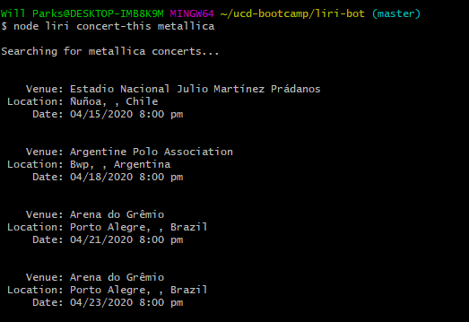
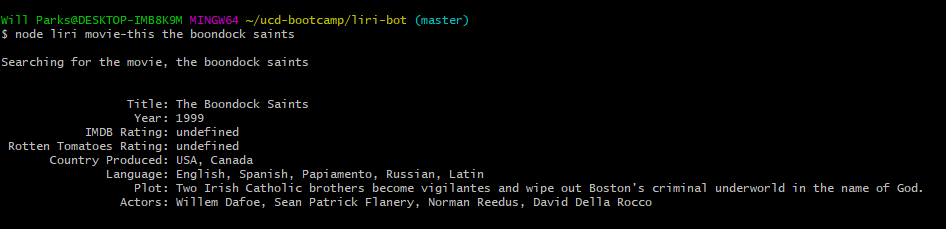
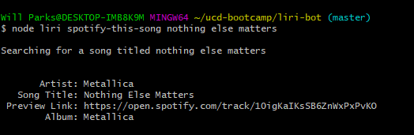
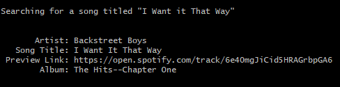

# LIRI Bot

<!-- 1. Clearly state the problem the app is trying to solve -->

LIRI Bot is a CLI app running on Node.js, which takes in parameters and gives back data.

<!-- 2. Give a high-level overview of how the app is organized -->
## Organization
The app is organized into modules separating each search function (more on these below). By supplying a specific command and search term on the command line, LIRI will return information relating to the command given.

<!-- 3. Git start-to-finish instructions on how to run the app -->
## Running the app
Running this app requires [Node.js](https://www.nodejs.org) to be installed on your system.

1. Clone this repository to your local machine
2. Run `npm install` to install the required modules
3. Create a `.env` file in the root directory of the project, and supply the following variables:
   - `SPOTIFY_ID` -- this is your Spotify ID
   - `SPOTIFY_SECRET` -- this is your Spotify Secret key
   - `OMDB_API_KEY` -- this is your OMDB API key
   - `LOG_FILE` -- the file name to save output to
4. Run the app as follows:
`node liri [command] [search term]`

Where command is one of:
- `concert-this`
- `spotify-this-song`
- `movie-this`
- `do-what-it-says`**

`search term` may be any term you wish - spaces are okay.

**This command will grab a command from a local text file, `random.txt`. The text file should only contain one command accompanied by a search term, separated by a space. On the command line, omit `search term` when using this command.
<!-- 4. Include screenshots, gifs, or videos of the app functioning -->
## Usage
`concert-this`

`movie-this`

`spotify-this-song`

`do-what-it-says`

<!-- 6. Clearly list the technologies used in the app -->
## Technologies Used
<b>Built with</b>
* [Node.js](https://www.nodejs.org) is used for its fantastic support via various packages (Axios, DotEnv, fs, and node-spotify-api), and to help organize commands in a modular way.
<!-- 7. State your role in the app development -->

## Credits

- <b>Developed By</b>: Will Parks -- [wparks08](https://www.github.com/wparks08)
